<p align="center">
  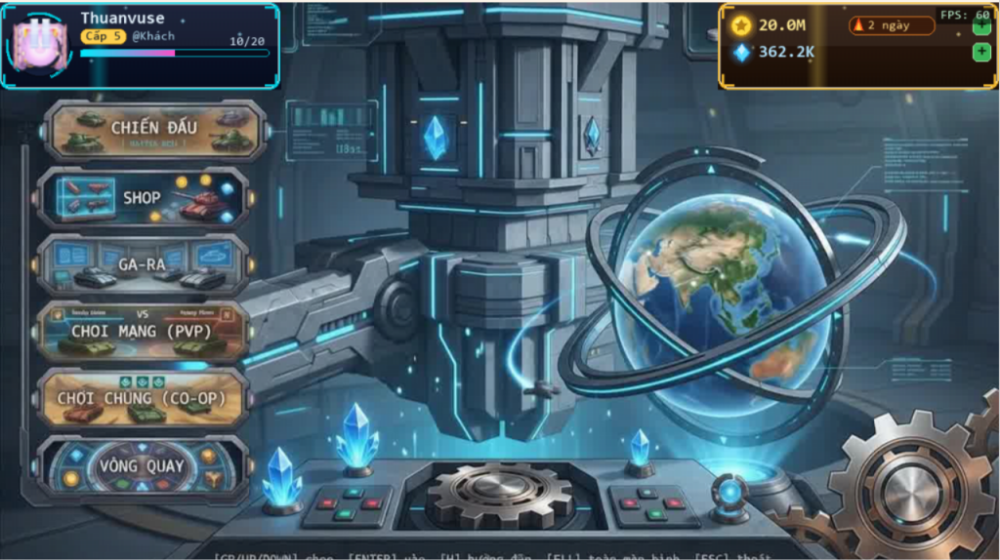
</p>

<h1 align="center">🔥 TANK ĐẠI CHIẾN - ULTIMATE EDITION v3.0 🔥</h1>

<p align="center">
  <b>Siêu phẩm bắn xe tăng Arcade 2D mang đậm phong cách cổ điển huyền thoại Battle City với đồ họa vẽ bằng thuật toán siêu nét (Procedural Render), hệ thống AI tự động chơi cực thông minh, chế độ mạng PvP đỉnh cao và cơ chế điều khiển cực mượt!</b>
</p>

<p align="center">
  
  
  
  
</p>

<p align="center">
  <b>💖 ỦNG HỘ NHÀ PHÁT TRIỂN (DONATE & SUPPORT) 💖</b><br>
  <i>Nếu bạn yêu thích dự án này và muốn tiếp thêm động lực cho tác giả phát triển thêm nhiều tính năng mới, hãy quét mã QR bên dưới nhé! Xin chân thành cảm ơn sự đồng hành và ủng hộ của bạn!</i>
</p>

<p align="center">
  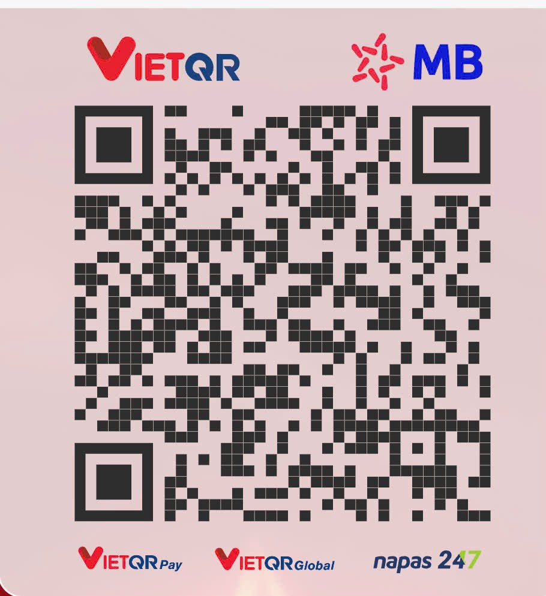
</p>

---

## 🌟 Trực Quan Chiến Đấu (Gameplay Demo)

<p align="center">
  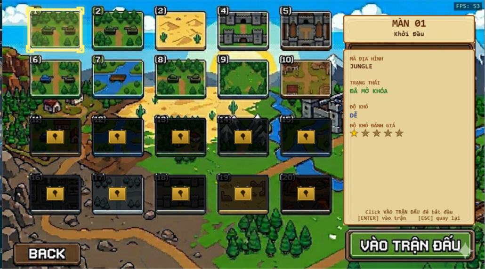
</p>

---

## 🖼️ Thư Viện Hình Ảnh Tính Năng (Game Features Gallery)

<p align="center">Đây là bộ sưu tập các tính năng và giao diện cực kỳ đặc sắc của game:</p>

| 🌌 Sảnh Chờ Game (Lobby Room) | 🛒 Cửa Hàng Thú Cưng (Pet Shop) |
| :---: | :---: |
| 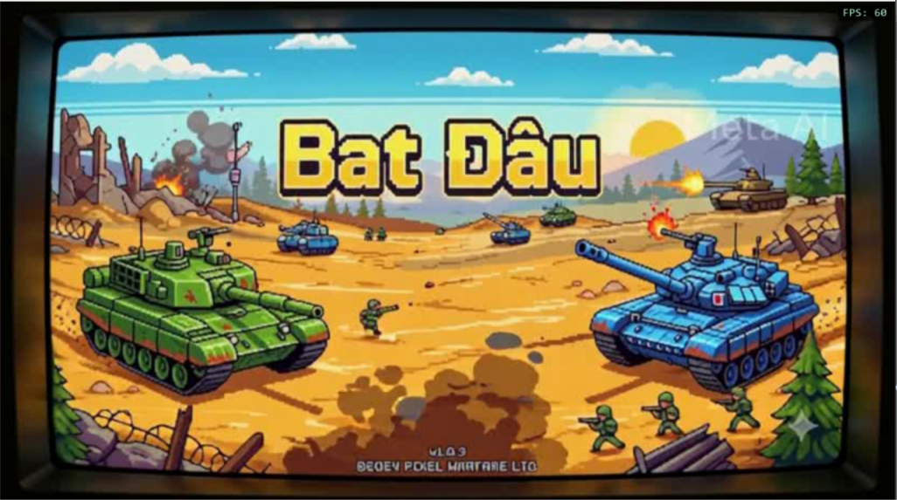 | 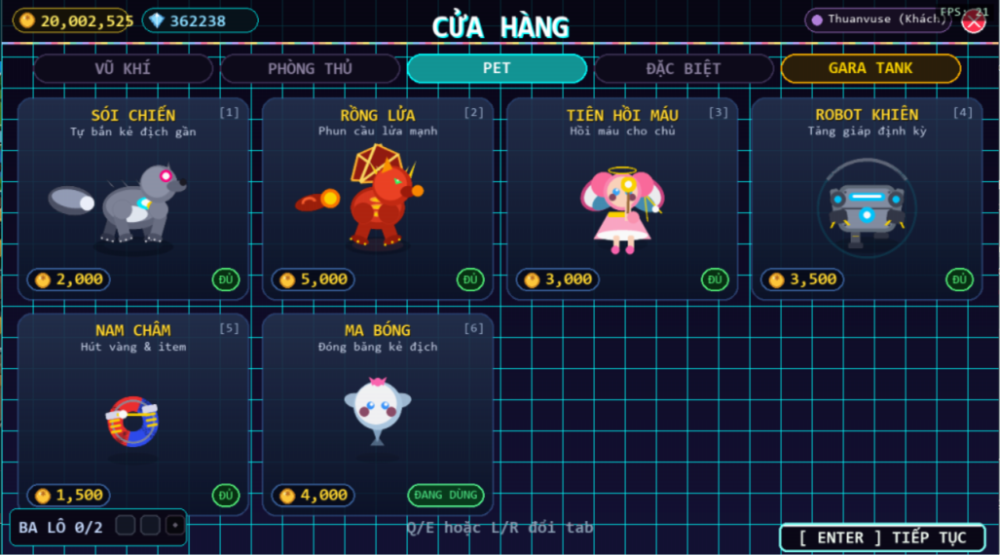 |

| 👥 Chế Độ Co-op 2 Người (Cooperative) | ⚔️ Đấu Trường PVP Đối Kháng |
| :---: | :---: |
| 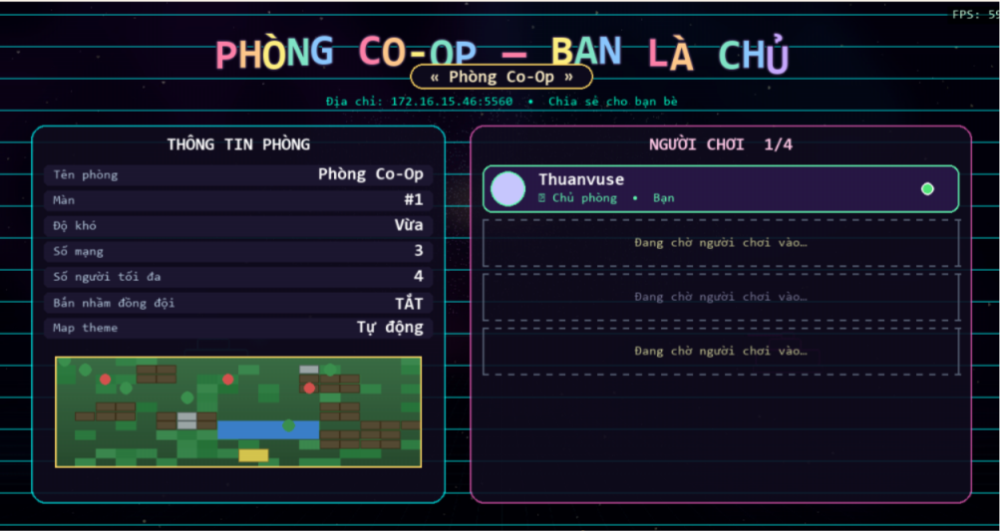 | 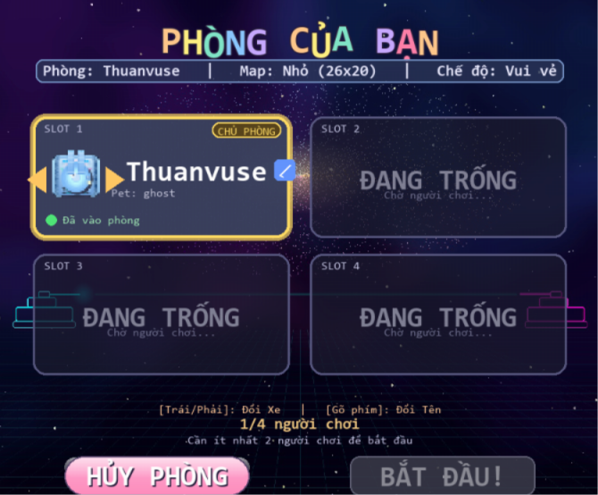 |

| 🏎️ Gara Chọn Xe Tăng (Garage) | 🎡 Vòng Quay May Mắn (Lucky Spin) |
| :---: | :---: |
| 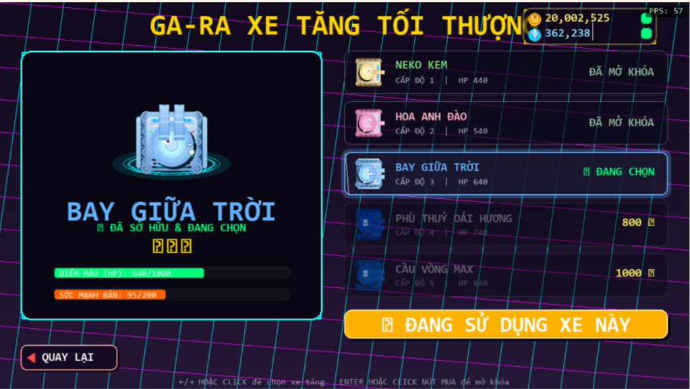 | 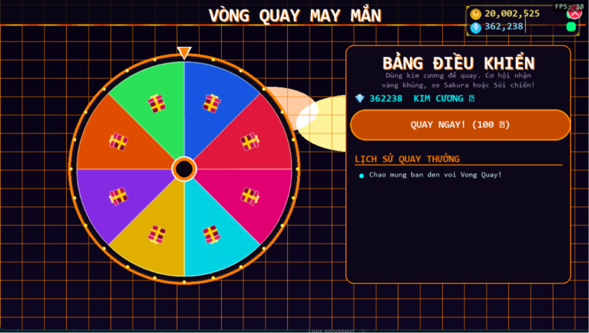 |

| ⚙️ Cài Đặt Trò Chơi (Settings) | 🏢 Phòng Chờ Tạo Đấu PVP |
| :---: | :---: |
| 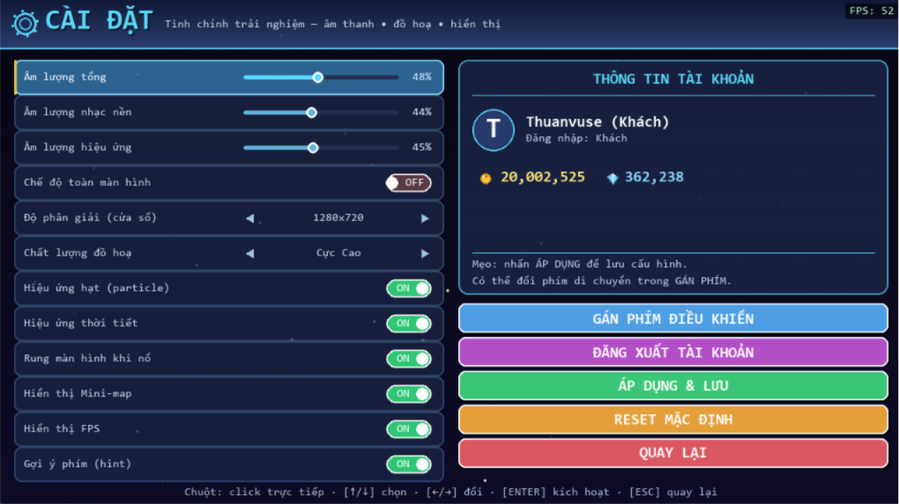 | 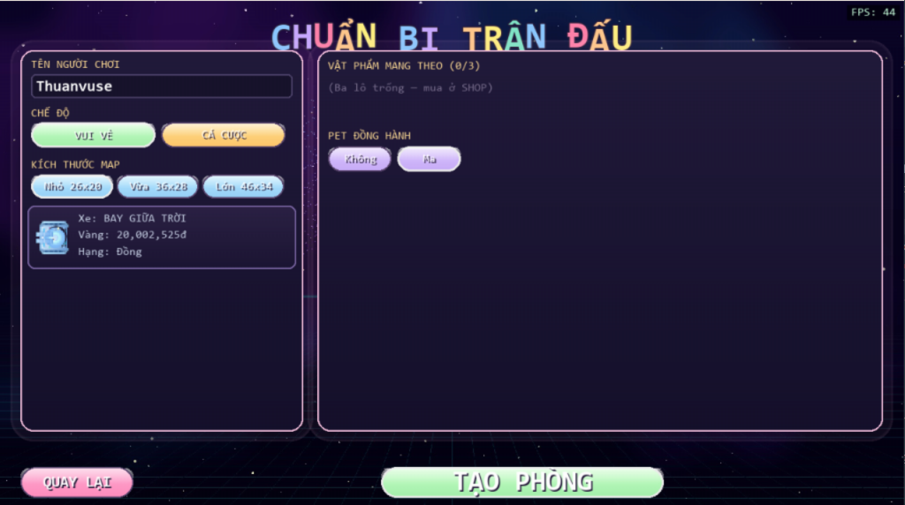 |

---

## 📖 Giới Thiệu Dự Án

**Tank Đại Chiến - Ultimate Edition** là một dự án game bắn xe tăng 2D đỉnh cao được xây dựng hoàn toàn từ số không bằng ngôn ngữ **Python** và thư viện **Pygame**. 

Điểm độc bản mang lại đẳng cấp vượt trội cho trò chơi nằm ở **Cơ chế đồ họa Procedural (Sinh mã đồ họa động tại Runtime)**: Toàn bộ sprite từ xe tăng, đạn bắn, chướng ngại vật (gạch, thép, cỏ, nước, hòm gỗ) cho đến hiệu ứng cháy nổ hạt đều được vẽ trực tiếp bằng các thuật toán toán học tiên tiến thông qua tệp `sprites.py` với chất lượng **20x Supersampled (Siêu lấy mẫu khử răng cưa)** – mang lại hình ảnh mượt mà, sắc nét đỉnh cao mà không cần tải bất kỳ tệp hình ảnh rời nào!

---

## ⚡ Các Tính Năng Cao Cấp Mới Nâng Cấp (New Premium Updates)

Nhằm mang lại trải nghiệm chơi mượt mà nhất như các tựa game AAA hiện đại, chúng tôi đã nâng cấp và tối ưu hóa hệ thống cốt lõi của trò chơi:

*   🚀 **Siêu Khử Lag & Đột Phá Hiệu Năng (60 FPS Lock):** Thay thế việc co giãn hình ảnh (`pygame.transform.scale`) lặp đi lặp lại ở mỗi khung hình bằng bộ nhớ đệm thông minh `scaled_tile_cache` vẽ động. Game chạy khóa cứng ở **60 FPS mượt mà tuyệt đối** ngay cả trên các bản đồ khổng lồ ở màn 7 trở đi (hơn 2300 ô gạch).
*   🎮 **Cơ Chế Lái Xe Tăng Chuẩn Arcade (AAA Corner-Sliding):** Tích hợp thuật toán tự động căn giữa làn đường (Lane Alignment) kết hợp **bo cua thông minh (Corner Alleviation)**. Xe tăng sẽ tự động lướt mượt mà qua các mép tường hẹp mà không bao giờ bị khựng, mang lại phản xạ chiến đấu đỉnh cao.
*   🧭 **Di Chuyển Chéo Siêu Mượt (True Diagonal Movement):** Cho phép người chơi di chuyển chéo hoàn toàn mượt mà, tự động phân tích và trượt dọc theo các bức tường khi đi chéo mà không bị dừng đột ngột.
*   📐 **Tự Động Thu Nhỏ Bản Đồ Con (Smart Compact Mini-map):** Bản đồ con được cố định kích thước tối đa khoa học `240x180` pixels. Bản đồ càng to sẽ tự động co nhỏ các chi tiết lại, hoàn toàn không phình to che khuất tầm nhìn của người chơi.
*   🔒 **Khóa Trỏ Chuột Thông Minh (Mouse Input Grab):** Tự động khóa con trỏ chuột trong phạm vi cửa sổ trò chơi khi chiến đấu nhằm loại bỏ hoàn toàn việc trỏ chuột bị trượt ra ngoài bấm nhầm, tự động giải phóng chuột khi game Tạm dừng (`Pause`) hoặc ở Sảnh chờ (`Lobby`).
*   🛡️ **Bảo Vệ Can Cứ Tuyệt Đối (Invulnerable Base):** Loại bỏ hoàn toàn khối Nhà chính Star-Heart dễ bị phá hủy bởi đồng đội hoặc Boss bắn nhầm ở chế độ tự động chơi. Giờ đây bạn có thể thoải mái chiến đấu xả láng mà không sợ bị "tự hủy"!
*   🖥️ **Độ Phân Giải Vàng Mặc Định (`1024x576`):** Tối ưu hóa kích thước cửa sổ mở ban đầu vừa vặn tuyệt đẹp với mọi dòng màn hình laptop (đặc biệt là máy tính có chế độ High-DPI Windows Scaling), cho phép kéo giãn tự do hoặc ấn **`F11`** để chơi toàn màn hình sắc nét.

---

## 🎮 Hướng Dẫn Điều Khiển (Game Controls)

Trò chơi hỗ trợ hệ thống điều khiển kết hợp WASD + Chuột vô cùng hiện đại và dễ làm quen:

| Phím bấm | Hành động trong game |
| :--- | :--- |
| **`W` `A` `S` `D`** / **Arrow Keys** | Di chuyển xe tăng (hỗ trợ di chuyển chéo siêu mượt) |
| **`Chuột Trái / Phím Space`** | Bắn đạn ngắm theo hướng con trỏ chuột |
| **`L-Shift / R-Shift`** | Kích hoạt tăng tốc (Sprint) - Tiêu hao năng lượng |
| **`Esc`** | Tạm dừng game (Pause) / Quay lại Menu chính |
| **`F11`** | Bật/Tắt chế độ Toàn màn hình (Fullscreen) |
| **`F`** | Bật/Tắt chế độ AUTO (Để AI tự động điều khiển chiến đấu) |
| **`G`** | Thay đổi thuật toán tìm đường của AI (**A*** -> **BFS** -> **DFS**) |
| **`1` / `2` / `3`** | Sử dụng nhanh vật phẩm bổ trợ trong Ba lô (Slot 1, 2, 3) |
| **`Q` / `E`** | Chuyển đổi qua lại giữa các tab trong Cửa hàng (Shop) |
| **`0` - `9`** | Mua nhanh vật phẩm tương ứng trong Cửa hàng |

---

## 🎨 Thế Giới Bản Đồ & Chu Đề Thần Thoại

Trò chơi bao gồm **7 vùng đất độc đáo** xoay vòng liên tục theo các màn chơi, đi kèm với các hiệu ứng thời tiết động chân thực:

| Vùng đất (Theme) | Mô tả phong cảnh | Hiệu ứng thời tiết |
| :--- | :--- | :--- |
| **🌲 Kawaii Woodland** | Khu rừng thần tiên dễ thương phong cách Nhật Bản | Cánh hoa đào bay lãng mạn |
| **🧱 Default** | Phong cách đấu trường cổ điển đậm chất Retro Battle City | Trời xanh mây trắng |
| **🏜️ Desert** | Hoang mạc cát vàng nóng bỏng, nắng cháy | Bão cát sa mạc mịt mù |
| **❄️ Snow** | Vùng đất tuyết rơi trắng xóa lấp lánh | Tuyết rơi mùa đông dày đặc |
| **🌆 City** | Thành phố hiện đại với những khối kính và bê tông | Mơn man mưa bay tầm tã |
| **🌴 Jungle** | Rừng rậm nhiệt đới ẩm ướt đầy chướng ngại vật | Mưa giông mưa rừng nhiệt đới |
| **🌋 Lava** | Vùng đất núi lửa phun trào nham thạch nguy hiểm | Than lửa và tro bụi đỏ rực bay |

---

## 🎖️ Hệ Thống Tiến Hóa Xe Tăng (Tank Upgrade Tiers)

Bạn có thể nâng cấp súng và thu thập chiến lợi phẩm ngay trên bản đồ để nâng cấp cấp độ xe tăng của mình với các chỉ số và hiệu ứng đặc trưng:

*   🟢 **Tier 1 (Xanh lá - Cơ bản):** Xe tăng chiến đấu hạng nhẹ, phát bắn cơ bản.
*   🟡 **Tier 2 (Vàng - Rapid Fire):** Nâng cao nòng pháo kép, tăng tốc độ nạp đạn đáng kể.
*   🟠 **Tier 3 (Cam - Heavy Shot):** Nòng pháo lớn, đạn bắn ra to hơn và sát thương cực mạnh.
*   🔴 **Tier 4 (Đỏ Cam - Piercing Laser):** Pháo năng lượng cao, đạn bắn xuyên phá qua gạch đá.
*   💎 **Tier 5 (Premium Chrome - Ultimate):** Sức mạnh hủy diệt tối đa, giáp siêu bền, bắn đạn chùm hủy diệt.

---

## 📦 Các Vật Phẩm Đặc Biệt & Vũ Khí Phụ (Power-Ups)

| Icon / Vật phẩm | Tác dụng tức thì |
| :--- | :--- |
| **❤️ Health** | Phục hồi ngay lập tức 1 Điểm máu (HP) |
| **🛡️ Shield** | Kích hoạt lá chắn năng lượng bảo vệ bất tử tạm thời |
| **⚡ Speed** | Hồi đầy thanh năng lượng chạy nhanh ngay lập tức |
| **⭐ Star (Clear)** | Kích nổ quả bom nguyên tử xóa sổ toàn bộ kẻ địch trên màn hình |
| **❄️ Freeze** | Đóng băng, làm bất động toàn bộ quân địch trong 5 giây |
| **🚀 Rocket** | Bắn ra tên lửa tầm nhiệt tự tìm và tiêu diệt mục tiêu lớn nhất |
| **🔥 Flame** | Kích hoạt súng phun lửa đốt cháy mọi chướng ngại vật trên đường đi |

---

## 🛠️ Yêu Cầu Hệ Thống & Cài Đặt (System Setup)

### 📋 Yêu cầu cấu hình tối thiểu
*   **Hệ điều hành:** Windows 10/11, macOS, hoặc Linux
*   **Python version:** `>= 3.9` (Khuyên dùng Python 3.10+)
*   **Pygame version:** `>= 2.6.0`

### 💻 Các bước chạy trò chơi nhanh chóng

#### Cách 1: Chạy bằng mã nguồn gốc (Khuyên dùng)
```bash
# 1. Tải dự án về máy của bạn
git clone https://github.com/Thuanvuse/Tank_Battle_python_game.git
cd Tank_Battle_python_game

# 2. Cài đặt các thư viện cần thiết
pip install -r requirements.txt

# 3. Khởi động trò chơi
python tank_game.py
```

#### Cách 2: Chạy tự động (Dành riêng cho Windows)
Bạn chỉ cần nhấp đúp chuột vào tệp **`setup_and_run.bat`**. Tệp script thông minh này sẽ tự động:
1. Kiểm tra môi trường Python trên máy tính.
2. Tự động cài đặt thư viện `pygame` nếu máy chưa có.
3. Kích hoạt trò chơi ngay lập tức mà không cần gõ lệnh.

#### Cách 3: Đóng gói thành file chạy độc lập (.exe)
Nhấp đúp chuột vào tệp **`build_exe.bat`** để tự động đóng gói dự án thành một tệp ứng dụng `dist/TankBattle.exe` duy nhất để bạn có thể gửi tặng bạn bè chơi trực tiếp không cần cài Python.

---

## 📂 Sơ Đồ Cấu Trúc Dự Án (Project Folder Map)

```text
Tank_Battle_python_game/
├── tank_game.py          # Vòng lặp game cốt lõi, State Machine và xử lý sự kiện (9,700+ dòng code)
├── sprites.py            # Công cụ vẽ Procedural sinh động đồ họa khử răng cưa siêu mẫu (2,200+ dòng code)
├── requirements.txt      # Tệp danh sách các thư viện cần cài đặt (pygame, numpy...)
├── save_data.json        # Tệp lưu trữ tiền vàng, kim cương và tiến trình mở khóa màn chơi
├── nhacnen.mp3           # Nhạc nền Retro hoành tráng, cuốn hút của trò chơi
├── TACH.mp3              # Tệp hiệu ứng âm thanh sống động khi bắn và nổ tung
├── setup_and_run.bat     # Tập lệnh cài đặt và mở game nhanh trên Windows
├── build_exe.bat         # Tập lệnh đóng gói game thành tệp .exe chạy độc lập
├── .gitignore            # Cấu hình loại trừ các tệp tạm thời khỏi Git
├── README.md             # Tệp hướng dẫn sử dụng và giới thiệu trò chơi chi tiết
├── IMG/                  # Thư mục chứa các tệp hình ảnh sảnh giao diện chính
│   ├── br.jpg            # Hình nền sảnh thiên hà tuyệt đẹp
│   └── pointer.png       # Tâm ngắm chuột chiến đấu tùy chỉnh
└── screenshots/          # Thư mục chứa các hình ảnh chụp màn hình giới thiệu
    ├── main_menu.png
    ├── level_select.png
    └── gameplay.png
```

---

## 👥 Tác Giả & Bản Quyền

*   **Phát triển bởi:** **Thuanvuse** 
*   **Bản quyền:** Dự án được thiết kế vì mục đích học tập sáng tạo nghệ thuật lập trình trò chơi và giải trí lành mạnh. Nghiêm cấm sao chép thương mại hóa khi chưa có sự đồng ý của tác giả.

<p align="center">
  <b>🌟 Chúc bạn có những giây phút chiến đấu tuyệt vời và sảng khoái nhất! Have fun playing! 🌟</b>
</p>
